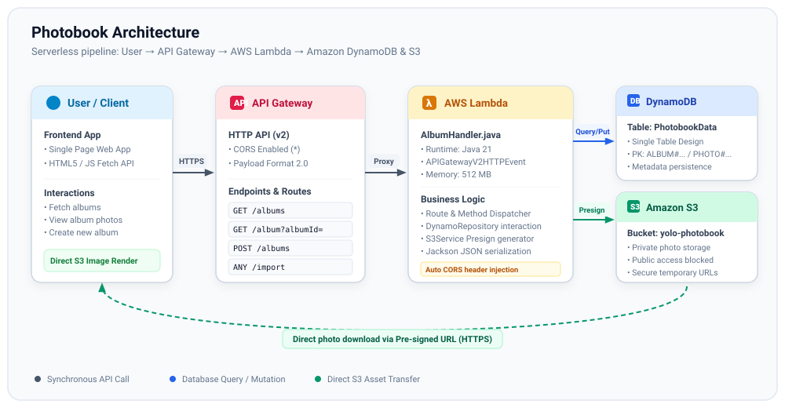
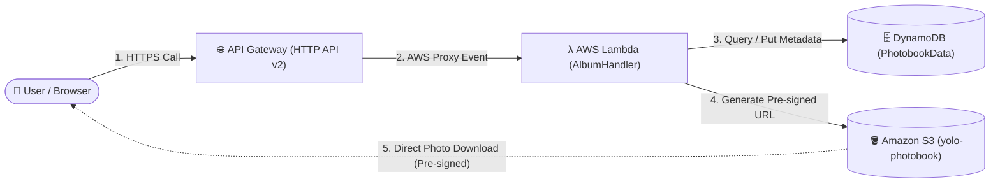

# Photobook - Java AWS Lambda Photo App

A Java application (AWS Lambda) that displays photos from Amazon S3 to a specific group of friends. It uses Amazon DynamoDB for metadata and S3 Pre-signed URLs for secure image access.

## Architecture



### Layer Overview
1. **User / Client Layer**:
   - Web frontend (Single Page HTML/JS) executing REST calls to API Gateway and rendering photos directly via temporary pre-signed S3 URLs.
2. **API Management Layer (Amazon API Gateway HTTP API v2)**:
   - Routes requests (`/albums`, `/album`, `/import`) and handles CORS headers for the backend Lambda function.
3. **Compute Layer (AWS Lambda - `AlbumHandler.java`)**:
   - Runs on the Java 21 runtime.
   - Handles `APIGatewayV2HTTPEvent` requests in [`AlbumHandler`](src/main/java/nl/arnovanoort/photobook/AlbumHandler.java).
   - Interacts with DynamoDB via `DynamoRepository` and generates secure pre-signed download URLs via `S3Service`.
4. **Persistence & Storage Layer**:
   - **Amazon DynamoDB (`PhotobookData`)**: Single Table Design for metadata (albums, photos, comments).
   - **Amazon S3 (`yolo-photobook`)**: Private object storage for original image files.



- **Backend**: Java 21 (AWS SDK v2) in AWS Lambda.
- **Database**: Amazon DynamoDB (Single Table Design).
- **Storage**: Amazon S3 (Private bucket).
- **Infrastructure**: Terraform.
- **Frontend**: HTML/JS (S3 Pre-signed URLs).

## Prerequisites
- Java 21 + Maven
- Terraform
- AWS CLI (configured with appropriate credentials)

## Build & Test
To compile the application and execute unit tests:
```bash
mvn clean package
```
This generates an executable "fat JAR" at `target/photobook-1.0-SNAPSHOT.jar`.

## Deployment
Infrastructure is managed with Terraform.

1. **Initialize Terraform** (one-time setup):
   ```bash
   terraform init
   ```
2. **Plan changes**:
   ```bash
   terraform plan
   ```
3. **Apply deployment**:
   ```bash
   terraform apply
   ```
   *Note: Ensure the variables in `infra.tf` (such as `BUCKET_NAME` and `TABLE_NAME`) match your target AWS resources.*

## DynamoDB Data Model (Single Table Design)
| Entity | Partition Key (PK) | Sort Key (SK) | Key Attributes |
| :--- | :--- | :--- | :--- |
| **Album** | `ALBUM#<ID>` | `METADATA` | `naam` (name), `locatie` (location), `datum` (date) |
| **Photo** | `ALBUM#<ID>` | `PHOTO#<ID>` | `titel` (title), `s3FileName`, `datum` (date) |
| **Comment** | `PHOTO#<ID>` | `COMMENT#<ID>` | `naam` (author), `tekst` (text), `datum` (date) |

## Frontend Usage
1. Open `src/main/resources/static/index.html` in a web browser.
2. In the `<script>` section, update the `fetch` URL to your deployed API Gateway endpoint.
3. Append `?albumId=1` to the page URL to load a specific album.

## Authentication (Roadmap)
The current version temporarily runs without authentication for testing purposes. In the next phase, AWS Cognito (Google OAuth) will be integrated and email whitelist verification will be enabled in the Lambda handler.
